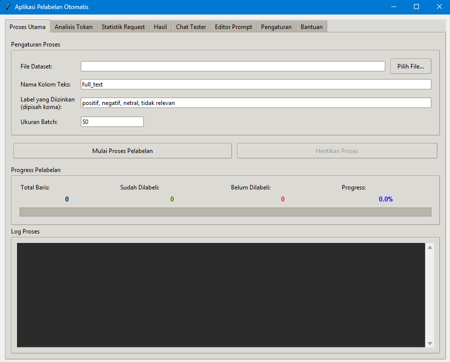

# Aplikasi Pelabelan Data Otomatis dengan Gemini

Aplikasi desktop GUI untuk otomatisasi pelabelan data teks menggunakan Google Gemini API. Dilengkapi dengan fitur resume capability, single file output, progress tracking real-time, dan batch optimization untuk efisiensi quota.



---

## ✨ Fitur Utama

### 🚀 **Core Features**
- **Setup Sekali Klik**: Automated environment setup dengan `start.bat`/`start.sh`
- **Modern GUI Interface**: 8 tab terorganisir untuk workflow lengkap
- **Single File Output**: Format `namafile_labeled_YYYYMMDD_HHMMSS.xlsx` di `results/`
- **Resume Capability**: Auto-resume dari posisi terakhir tanpa kehilangan progress
- **Progress Tracking**: Real-time display total/labeled/unlabeled rows + progress bar
- **Batch Optimization**: Skip complete/partial batches, fokus pada empty batches

### 🎯 **Advanced Features**
- **Token Analysis**: Estimasi biaya dan optimasi batch size sebelum processing
- **Request Tracking**: Comprehensive monitoring dengan session management
- **Multiple API Keys**: Auto-rotation untuk maximize throughput
- **Model Fallback System**: Auto-switch model ketika quota habis
- **Chat Tester**: Test prompt dan validasi output format sebelum processing
- **Configurable Everything**: Dynamic config tanpa restart aplikasi

---

## 🖥️ Interface Overview

### **Tab 1: Proses Utama**
- File dataset input (CSV/XLSX)
- Nama kolom teks dan label yang diizinkan
- Ukuran batch dan kontrol start/stop
- **Progress tracking**: Total, labeled, unlabeled, percentage dengan progress bar
- Real-time logging

### **Tab 2: Analisis Token** 
- Token analysis untuk estimasi biaya
- Test batch size optimal
- Request langsung ke model untuk akurasi
- Rekomendasi konfigurasi

### **Tab 3: Statistik Request**
- Session monitoring dan request tracking
- Success rate dan performance metrics
- API key usage statistics

### **Tab 4-8: Tools & Configuration**
- Editor prompt, chat tester, hasil pelabelan
- Pengaturan model dan API keys
- Help dan documentasi

---

## 🚀 Quick Start

### Windows
```bash
# Download dan jalankan
git clone https://github.com/muhffikkri/auto-labeling-data-text-aistudio.git
cd auto-labeling-data-text-aistudio

# Klik dua kali start.bat atau:
start.bat
```

### macOS/Linux
```bash
# Download dan jalankan
git clone https://github.com/muhffikkri/auto-labeling-data-text-aistudio.git
cd auto-labeling-data-text-aistudio

# Setup permission dan jalankan
chmod +x start.sh
./start.sh
```

### Workflow Pertama Kali
1. **Tab Pengaturan**: Input Google API Key dan save
2. **Tab Editor Prompt**: Sesuaikan prompt untuk use case Anda
3. **Tab Chat Tester**: Test prompt dengan sample data
4. **Tab Analisis Token**: Analisis biaya dan optimasi batch size
5. **Tab Proses Utama**: Select file, configure, dan mulai processing

---

## 📊 Single File Output & Resume System

### **Konsep Utama**
```
Dataset Original → Copy ke results/ → Update in-place → Single file output
```

### **Format Output**
```
results/project_name/
└── project_name_labeled_20251005_143022.xlsx
```

### **Resume Logic**
- **Auto-detect**: Scan existing output files otomatis
- **Progress analysis**: Hitung baris labeled vs unlabeled
- **Smart resume**: Lanjutkan dari batch yang belum complete
- **Batch optimization**: Skip complete/partial batches untuk efisiensi quota

### **Progress Tracking**
- **Total Baris**: Counter total dataset
- **Sudah Dilabeli**: Progress yang sudah selesai (hijau) 
- **Belum Dilabeli**: Remaining work (merah)
- **Progress %**: Persentase dengan visual progress bar
- **Real-time updates**: Update otomatis saat processing

---

## 💡 Best Practices

### **1. Optimasi Batch Size**
```bash
# Analisis dulu sebelum processing
Tab Analisis Token → Input dataset → Test batch sizes → Pilih optimal

# Trade-off considerations:
- Batch kecil (20-50): Aman dari token limit, tapi banyak API calls
- Batch besar (100-300): Efisien quota, tapi risiko token limit
- Sweet spot: 50-100 untuk most cases
```

### **2. Efficient Resume Strategy**
```
Processing interrupted → Next run auto-resume → Skip completed batches
```

### **3. Prompt Optimization**
```bash
# Always test first:
Tab Editor Prompt → Customize → Tab Chat Tester → Validate → Process

# Key points:
- Spesifik format output: "Label - Justifikasi"
- Sinkronkan dengan "Label yang Diizinkan"
- Include relevant examples
```

### **4. Quota Management**
```bash
# Multiple API keys untuk throughput maksimal
.env file:
GOOGLE_API_KEY_1="key1"
GOOGLE_API_KEY_2="key2"
GOOGLE_API_KEY_3="key3"

# Model fallback untuk continuity
MODEL_FALLBACK_LIST="gemini-2.5-pro,gemini-1.5-pro,gemini-1.5-flash"
```

---

## 🔧 Configuration Guide

### **Environment Setup (.env)**
```bash
# Core Configuration
MODEL_NAME="gemini-1.5-pro-latest"
OUTPUT_DIR="results"
DATASET_DIR="datasets"

# Multiple API Keys (auto-rotation)
GOOGLE_API_KEY_1="your_primary_key_here"
GOOGLE_API_KEY_2="your_secondary_key_here" 
GOOGLE_API_KEY_3="your_tertiary_key_here"

# Model Fallback (auto-switch when quota exhausted)
MODEL_FALLBACK_LIST="gemini-2.5-pro,gemini-1.5-pro,gemini-1.5-flash"

# Optional Advanced Settings
MAX_RETRIES=3
TIMEOUT_SECONDS=30
LOG_LEVEL="INFO"
ENABLE_REQUEST_TRACKING=true
ENABLE_SESSION_LOGGING=true
```

### **Prompt Template Structure**
```
Anda adalah expert annotator untuk [domain]. 

Tugas: Labeli teks dengan kategori: [list_labels]

Format Output WAJIB: "Label - Justifikasi"

Contoh:
Input: "Produk ini mengecewakan sekali"
Output: "negatif - Menggunakan kata 'mengecewakan' yang menunjukkan ketidakpuasan"

Teks untuk dilabeli:
{data_to_process}
```

---

## 🛠️ Tools & Utilities

### **Token Analysis Tool**
```bash
# Via GUI: Tab Analisis Token
# Via CLI:
python tools.py check-tokens --dataset tweets --column text --batch-size 100

# Output: Token count, cost estimation, batch recommendations
```

### **Model Information**
```bash
# List available models
python tools.py list-models

# With quota details
python tools.py list-models --show-details

# Generate fallback config
python tools.py list-models --generate-config
```

### **Session Analysis**
```bash
# View session history
python -m src.core_logic.session_viewer

# Analyze specific session
python -m src.core_logic.session_viewer --session session_20251005_143022
```

---

## 📂 Project Structure

```
auto-labeling-data-text-aistudio/
├── src/
│   ├── core_logic/           # Core processing logic
│   │   ├── process.py        # Main labeling orchestration
│   │   ├── request_tracker.py   # Request monitoring
│   │   ├── session_manager.py   # Session logging
│   │   ├── check_tokens.py   # Token analysis tool
│   │   └── list_models.py    # Model information tool
│   └── gui/
│       └── app.py           # GUI application
├── datasets/                # Input datasets
│   └── data_sample/
├── results/                 # Output results
├── logs/                   # Session and error logs
├── tests/                  # Testing framework
├── .env                    # Configuration file
├── .env.example           # Configuration template
├── main.py                # Application entry point
├── tools.py               # CLI utilities wrapper
├── start.bat / start.sh   # Setup scripts
└── requirements.txt       # Dependencies
```

---

## 🧪 Testing Framework

```bash
# Run all tests
pytest

# Unit tests only  
pytest tests/unit/

# Integration tests
pytest tests/integration/

# Specific test
pytest tests/unit/test_process_utils.py -v
```

---

## 📈 Performance & Monitoring

### **Session Tracking**
- Comprehensive logging di `logs/sessions/`
- Request metrics dan success rates
- Performance analytics per session
- Error tracking dan resolution

### **Request Monitoring**
- Real-time statistics di Tab Statistik Request
- API key usage distribution
- Response time tracking
- Quota utilization monitoring

### **File Management**
- Single file output untuk easy management
- Atomic saves untuk data integrity
- Resume capability untuk reliability
- Progress persistence across sessions

---

## 🚨 Troubleshooting

### **Common Issues**

**Q: Processing terhenti/hanging**
```bash
A: System sudah dilengkapi deadlock protection dan timeout mechanisms
   - Check Tab Statistik Request untuk monitoring
   - Restart aplikasi untuk reset state
   - Periksa logs/ untuk error details
```

**Q: Token limit exceeded**
```bash
A: Reduce batch size di Tab Analisis Token
   - Test optimal batch size first
   - Consider shorter texts atau smaller batches
   - Check model limits di documentation
```

**Q: API quota habis**
```bash  
A: Setup multiple API keys dan model fallback
   - Add more keys di .env file
   - Enable MODEL_FALLBACK_LIST
   - Monitor usage di Tab Statistik Request
```

### **Debug Mode**
```bash
# Enable detailed logging
LOG_LEVEL="DEBUG"

# Check specific logs
tail -f logs/labeling_*.log
tail -f logs/sessions/session_*/session.log
```

---

## 🤝 Contributing

```bash
# Development setup
git clone <repo>
pip install -r requirements-dev.txt

# Run tests
pytest

# Code formatting  
black src/ tests/
flake8 src/ tests/

# Type checking
mypy src/
```

---

## 📄 License

MIT License - see LICENSE file for details.

---

## 🆘 Support

- **Issues**: GitHub Issues untuk bug reports
- **Discussions**: GitHub Discussions untuk questions
- **Documentation**: Tab Help di dalam aplikasi
- **CLI Help**: `python tools.py --help`